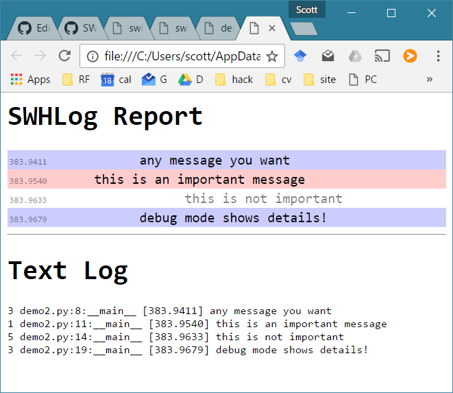

# SWHLog
SWHLog simplifies logging/debugging. There are great tools like logging which do many fancy things, but the goal of swhlog is to be as simple as possible.

**Installation:** `pip install swhlog`

### Basic Usage
```python
import swhlog
from swhlog import log,attention

# it's easy to log things with log()
log("any message you want")

# optionally a loglevel can be defined
log("this is an important message",1)

# if loglevel>3, it will be logged but not displayed
log("this is not important",5)

# attention() sends a message to console without logging it
attention("turning debug mode on")
swhlog.debugMode=True # causes more informationt to display
log("debug mode shows details!")

# now launch the output in the web browser
swhlog.getLogHTML()
```

### Console Output
```
[429.1242] --- any message you want
[429.1346] - this is an important message
[429.1460] ----- this is not important

##################################################
### TURNING DEBUG MODE ON
##################################################

demo2.py:16:__main__ [429.1542] --- debug mode shows details!
```

_note that when debugMode=True, the log displays the file name, line number, and function from which log() was called! This is extremely helpful when debugging. The time is the number of seconds since the module was first imported._

### HTML Output


_html files are formatted nicely so log entries are color-coded and indented by log level_
